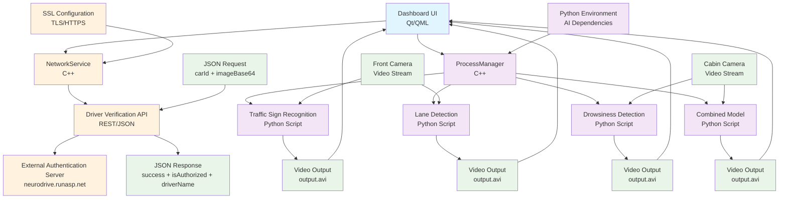

# NeuroDrive Dashboard

A modern Qt/QML-based dashboard application for NeuroDrive with dark mode support and AI-powered driver assistance features.

## Features

- Secure driver verification with facial recognition API integration
- Modern UI dashboard with dark/light mode support
- Front camera monitoring with:
  - Traffic Sign Recognition
  - Lane Detection
  - Combined Drowsiness & Traffic Sign analysis
- Cabin camera monitoring with:
  - Distraction Monitoring
  - Drowsiness Detection
- Settings panel with theme customization
- Responsive interface optimized for vehicle displays

## System Architecture

The NeuroDrive system consists of multiple interconnected components working together to provide comprehensive driver assistance:



### Component Overview:

- **Dashboard UI (Qt/QML)**: Main user interface providing navigation and controls
- **NetworkService**: Handles HTTP/HTTPS API communication with authentication services
- **ProcessManager**: Manages execution and monitoring of AI model Python scripts
- **AI Models**: Python-based machine learning models for various detection tasks
- **Camera Inputs**: Front and cabin camera video streams for processing
- **Video Outputs**: Processed video files with AI annotations and detection results

## JSON Communication

The NeuroDrive dashboard communicates with external services using JSON format for data exchange. Below are the detailed specifications:

### Driver Verification API

**Endpoint**: `/api/verify-driver`
- **Local Development**: `https://localhost:5041/api/verify-driver`
- **Production**: `https://neurodrive.runasp.net/api/verify-driver`

#### Request Format
```json
{
  "carId": "string",
  "imageBase64": "data:image/jpeg;base64,[BASE64_ENCODED_IMAGE]"
}
```

**Fields:**
- `carId`: Unique identifier for the vehicle (e.g., "111")
- `imageBase64`: Base64-encoded driver photo with MIME type prefix

**Example Request:**
```json
{
  "carId": "111",
  "imageBase64": "data:image/jpeg;base64,/9j/4AAQSkZJRgABAQAAAQABAAD/2wBDAAYEBQ..."
}
```

#### Response Format
```json
{
  "success": boolean,
  "isAuthorized": boolean,
  "message": "string",
  "driverName": "string"
}
```

**Fields:**
- `success`: Indicates if the API call was successful
- `isAuthorized`: Whether the driver is authorized for this vehicle
- `message`: Human-readable status message
- `driverName`: Name of the authorized driver (only present if authorized)

**Example Responses:**

*Successful Authorization:*
```json
{
  "success": true,
  "isAuthorized": true,
  "message": "Driver verified successfully",
  "driverName": "John Doe"
}
```

*Failed Authorization:*
```json
{
  "success": true,
  "isAuthorized": false,
  "message": "Driver not recognized or unauthorized"
}
```

*API Error:*
```json
{
  "success": false,
  "isAuthorized": false,
  "message": "Image processing failed"
}
```

### AI Model Communication

The dashboard communicates with AI models through the ProcessManager component using process-based communication:

#### Model Types
- **Type 1**: Traffic Sign Recognition
- **Type 2**: Drowsiness Detection  
- **Type 3**: Combined Drowsiness & Traffic Sign Analysis
- **Type 4**: Lane Detection

#### Model Execution Flow
1. Dashboard sends model start command via ProcessManager
2. Python scripts are executed with video input
3. Processed video output is saved to designated paths:
   - Traffic Signs: `/models/traffic_signs_detection_3/output.avi`
   - Lane Detection: `/models/lane_detection_3/output.avi`
   - Drowsiness: `/models/drowsiness_detection_f3/output.avi`
4. Dashboard monitors process status and loads output videos

### SSL Configuration

The application uses SSL/TLS for secure communication:
- Certificate validation is disabled for development environments
- Production deployments should use valid SSL certificates
- SSL configuration details are available in `ssl.txt`

## Screenshots

### Login Screen


### Main Dashboard


### Front Camera


### Cabin Camera


### Settings


## Requirements

- Qt 6.8 or later
- C++17 compatible compiler
- CMake 3.16 or later
- Network connectivity for driver verification API

## Building the Application

### Install Dependencies

Ensure you have Qt 6.8 or later, CMake 3.16 or later, and a C++17 compatible compiler installed.

### Clone the Repository

```bash
git clone https://github.com/youssef47048/NueroDrive/NeuroDrive.git
cd NeuroDrive_13_5_2025
```

### Build the Application

```bash
mkdir build
cd build
cmake ..
make -j4
```

### Run the Application

```bash
./appNeuroDrive_13_5_2025
```

## Usage

1. On startup, the application displays a login screen
2. Click the login button to verify the driver through facial recognition
3. Upon successful verification, the main dashboard is displayed
4. Use the dashboard buttons to navigate to different features:
   - Front Camera: Access traffic sign recognition and lane detection
   - Cabin Camera: Access driver monitoring features
   - Settings: Customize application appearance (dark/light mode)

## Development Notes

- The application uses Qt Quick for the UI
- Network requests are handled via the NetworkService class
- Face verification API endpoint for local: https://localhost:5041/api/verify-driver
- Face verification API endpoint: https://neurodrive.runasp.net/api/verify-driver
- Dark mode is implemented using dynamic property binding for colors

## Project Structure

- `main.cpp` - Application entry point
- `NetworkService.h/cpp` - Handles API requests and image processing
- `Main.qml` - Main application window with dashboard layout
- `qml/pages/` - QML page components (Login, Dashboard)
- `qml/components/` - Reusable UI components (FeatureButton, etc.)
- `img/` - Image resources

## Raspberry Pi 4 Optimization

If you're running this application on a Raspberry Pi 4, you may experience longer processing times. Here are the optimizations implemented:

### Performance Optimizations Applied:
1. **Video Resolution Scaling**: Videos larger than 640px width are automatically scaled down
2. **Frame Rate Limiting**: Processing is limited to 15 FPS maximum for better performance
3. **Frame Skipping**: Only every 3rd frame is processed for AI detection to reduce CPU load
4. **Progress Reporting**: Better feedback during long processing operations

### Expected Performance:
- **Video Processing Time**: 2-5 minutes for a 30-second video (depending on complexity)
- **UI Responsiveness**: The interface remains responsive during processing
- **Memory Usage**: Optimized to use less RAM through reduced resolution and frame skipping

### Recommended Settings for Raspberry Pi:
1. **Increase GPU Memory Split**: 
   ```bash
   sudo raspi-config
   # Navigate to Advanced Options > Memory Split > Set to 128 or 256
   ```

2. **Enable Camera and Hardware Acceleration**:
   ```bash
   sudo raspi-config
   # Enable Camera and GPU memory split
   ```

3. **Use High-Speed SD Card**: Class 10 or better for faster file I/O

4. **Ensure Adequate Cooling**: AI processing can heat up the Pi significantly

### Troubleshooting:

#### "Not Responding" Dialog:
- This is normal during initial video processing
- Wait for the processing to complete (check terminal for progress)
- The UI will become responsive once processing finishes

#### Video Not Loading:
- Check that the Python script completed successfully
- Look for `output.avi` file in the model directory
- Video loading may take 10-30 seconds after processing completes

#### Long Processing Times:
- Normal for Raspberry Pi 4 - AI models are computationally intensive
- Consider using smaller input videos for testing
- Monitor system temperature to avoid thermal throttling
